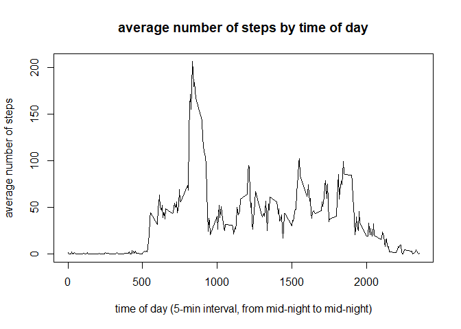
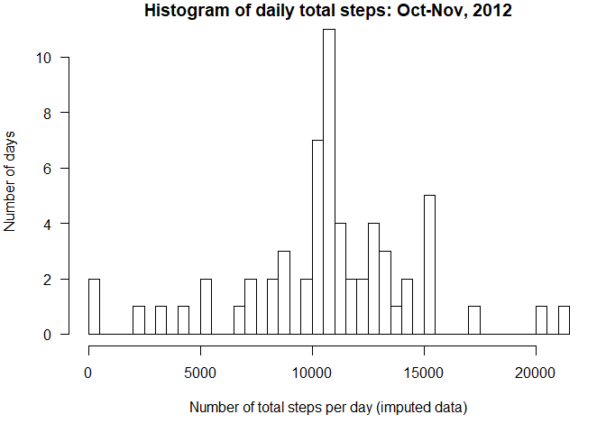
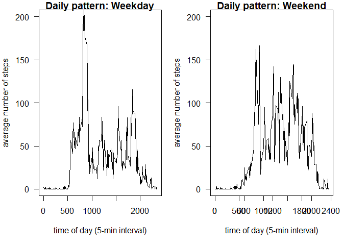

```r
knitr::opts_chunk$set(echo=TRUE, 
                      message=FALSE, 
                      comment = "")
date<-as.Date(Sys.time(	), format='%d%b%Y')
```
Last updated: 2019-12-04 

# Reproducible Research: Course Project 1  

This is for the Course Project 1, using activity monitoring data for a person over two months. There are four parts in this project:   
- PART 1: Total daily steps per day  
- PART 2: Activity pattern throughout the day  
- PART 3: Dealing with missing steps  
- PART 4: Activity pattern difference between weekdays and weekends   

But, first read and inspect the data. 

```r
# Read data
setwd("C:/Users/YoonJoung Choi/Dropbox/2 R/2 R Coursera/5ReproducibleResearch/CourseProject1")
data<-read.csv("repdata_data_activity/activity.csv")

# Explore data
str(data)
```

```
'data.frame':	17568 obs. of  3 variables:
 $ steps   : int  NA NA NA NA NA NA NA NA NA NA ...
 $ date    : Factor w/ 61 levels "2012-10-01","2012-10-02",..: 1 1 1 1 1 1 1 1 1 1 ...
 $ interval: int  0 5 10 15 20 25 30 35 40 45 ...
```

```r
summary(data)
```

```
     steps                date          interval     
 Min.   :  0.00   2012-10-01:  288   Min.   :   0.0  
 1st Qu.:  0.00   2012-10-02:  288   1st Qu.: 588.8  
 Median :  0.00   2012-10-03:  288   Median :1177.5  
 Mean   : 37.38   2012-10-04:  288   Mean   :1177.5  
 3rd Qu.: 12.00   2012-10-05:  288   3rd Qu.:1766.2  
 Max.   :806.00   2012-10-06:  288   Max.   :2355.0  
 NA's   :2304     (Other)   :15840                   
```

```r
head(data)
```

```
  steps       date interval
1    NA 2012-10-01        0
2    NA 2012-10-01        5
3    NA 2012-10-01       10
4    NA 2012-10-01       15
5    NA 2012-10-01       20
6    NA 2012-10-01       25
```

```r
#summary metrics for the text
numobs<-nrow(data)
numdate<-length(unique(data$date))
numinterval<-length(unique(data$interval))
```

The unit of this datset, activity, is specific to date and time intervals. There are 61 unique dates in October and November, 2012, and 288 unique time intervals in each day. Thus, the dataset has 17568 observations (61 x 288). 

There appears to be substantial number of missing values in "steps", probably due to the fact that people do not walk while sleeping. This will be investigated in Part 3.

## PART 1. What is mean total number of steps taken per day?

### 1.1 Calculate the total number of steps taken per day

```r
library(dplyr)
dailytotal <- as.data.frame(with(data, tapply(steps, date, sum, na.rm = T)))
colnames(dailytotal)<-c("dailytotal")
```

### 1.2. Make a histogram of the total number of steps taken each day

```r
par(mar=c(5, 4, 1, 1), las=1)
hist(dailytotal$dailytotal, breaks=50,
     main="Histogram of daily total steps: Oct-Nov, 2012", 
     xlab="Number of total steps per day",
     ylab="Number of days")
```

<!-- -->

### 1.3. Calculate and report the mean and median of the total number of steps taken per day

```r
# summary metrics for the text
obs<-nrow(dailytotal)
mean<-round(mean(dailytotal[,1]), 1)
median<-median(dailytotal[,1])

nostepdays<-dailytotal%>%
    subset(dailytotal==0)%>%
    nrow()
```
Across 61 days over the two months, the study subject person had on average 9354.2 steps per day. Median daily total number of steps is 10395.

But, he/she also had 8 days with no steps! This is odd for any person, and it can be due to missing values for the entire days. To be continued on this issue in part 3...  

## PART 2. What is the average daily activity pattern?

### 2.1. Make a time series plot of the 5-minute interval (x-axis) and the average number of steps taken, averaged across all days (y-axis)

```r
average <- with(data, 
                tapply(steps, interval, mean, na.rm = T))
interval<- with(data, 
                tapply(interval, interval, mean, na.rm = T))
dailypattern = cbind(average, interval) 

dailypattern<-data.frame(dailypattern)
plot(dailypattern$average~dailypattern$interval, 
     type="l",
     xlab="time of day (5-min interval, from mid-night to mid-night)",
     ylab="average number of steps",
     main="average number of steps by time of day")
```

<!-- -->
(Question: how can I improve the x axis?)

### 2.2. Which 5-minute interval, on average across all the days in the dataset, contains the maximum number of steps?

```r
# summary metrics for the text
max<-round(max(dailypattern$average),0)
time<-dailypattern$interval[which(dailypattern$average==max(dailypattern$average))]
```
On average, the five-minute interval between 835 and 840 had the maximum number of steps, which is 206.  

## PART 3. Imputing missing values
Note that there are a number of days/intervals where there are missing values (coded as NA). The presence of missing days may introduce bias into some calculations or summaries of the data.

### 3.1. Calculate and report the total number of missing values in the dataset 

```r
# summary metrics for the text
missing <- sum(is.na(data$steps)) 
obs <- nrow(data)
percent<-round(100*missing/obs, 1)
```
There are 2304 observations with missing steps, out of 17568 observations in total (13.1 %).  

### 3.2. Devise a strategy for filling in all of the missing values in the dataset. The strategy does not need to be sophisticated. For example, you could use the mean/median for that day, or the mean for that 5-minute interval, etc.

A strategy is to replace missing data with average daily pattern value (i.e., average of steps by interval across all dates).  

### 3.3. Create a new dataset that is equal to the original dataset but with the missing data filled in.

```r
datanew <- data
datanew$stepsnew<-datanew$steps
datanew$average <- with(datanew, 
                        tapply(steps, interval, mean, 
                                na.rm = T))

datanew$stepsnew[is.na(datanew$steps)]=datanew$average
```

```
Warning in datanew$stepsnew[is.na(datanew$steps)] = datanew$average: number
of items to replace is not a multiple of replacement length
```
### 3.4. Make a histogram of the total number of steps taken each day and Calculate and report the mean and median total number of steps taken per day. Do these values differ from the estimates from the first part of the assignment? What is the impact of imputing missing data on the estimates of the total daily number of steps?


```r
#initial daily total data
dailytotal <- with(data, 
                      tapply(steps, date, sum, 
                             na.rm = T))
summary(dailytotal) 
```

```
   Min. 1st Qu.  Median    Mean 3rd Qu.    Max. 
      0    6778   10395    9354   12811   21194 
```

```r
#imputed daily total data
dailytotalnew <- round(with(datanew, 
                      tapply(stepsnew, date, sum, 
                             na.rm = T)), 0)
summary(dailytotalnew) 
```

```
   Min. 1st Qu.  Median    Mean 3rd Qu.    Max. 
     41    9819   10766   10766   12811   21194 
```

```r
# histogram
par(mar=c(5, 4, 1, 1), las=1)
hist(dailytotalnew, breaks=50,
     main="Histogram of daily total steps: Oct-Nov, 2012", 
     xlab="Number of total steps per day (imputed data)",
     ylab="Number of days")
```

<!-- -->

```r
# summary metrics for the text 
meannew<-round(mean(dailytotalnew), 1)
mediannew<-median(dailytotalnew)
```
Using the initial data, mean of daily total steps is 9354.2, and median is 10395. With imputed data, there are no days with 0 steps: mean is 1.07662\times 10^{4}, and median is 1.0766\times 10^{4}. Because of imputed values in about 13.1 of the total 5-minute interval observations (i.e., value greater than 0/missing), the mean daily total steps increased from 9354.2 to 1.07662\times 10^{4}. 

(Questoin: How can I format the mean and median values nicely? Why is `round` function not working properly??)

## PART 4. Are there differences in activity patterns between weekdays and weekends?
For this part the weekdays() function may be of some help here. Use the dataset with the filled-in missing values for this part.

### 4.1. Create a new factor variable in the dataset with two levels - "weekday" and "weekend" indicating whether a given date is a weekday or weekend day.

```r
datanew$day <- weekdays(as.Date(datanew$date))
weekdays <- c('Monday','Tuesday','Wednesday',
              'Thursday','Friday')
datanew$weekday <- factor(datanew$day %in% weekdays, 
                        levels=c(TRUE, FALSE),                                     labels=c("weekday","weekend")) 
table(datanew$day, datanew$weekday)
```

```
           
            weekday weekend
  Friday       2592       0
  Monday       2592       0
  Saturday        0    2304
  Sunday          0    2304
  Thursday     2592       0
  Tuesday      2592       0
  Wednesday    2592       0
```

### 4.2. Make a panel plot containing a time series plot of the 5-minute interval (x-axis) and the average number of steps taken, averaged across all weekday days or weekend days (y-axis). 

```r
#calculaton and save it to a dataframe
average <- with(datanew, 
                tapply(stepsnew, list(interval,weekday),
                       mean, na.rm = T))
interval<- with(datanew, 
                tapply(interval, interval,
                       mean, na.rm = T))
dailypatternnew<-data.frame(cbind(average, interval))

#histogram
par(mar=c(5, 4, 1, 1), mfrow=c(1,2), las=1)
plot(dailypatternnew$interval, dailypatternnew$weekday, type="l",
     xlab="time of day (5-min interval)",
     ylab="average number of steps",
     main="Daily pattern: Weekday",
     ylim=c(0,200) )
plot(dailypatternnew$interval, dailypatternnew$weekend, type="l",
     xlab="time of day (5-min interval)",
     ylab="average number of steps",
     main="Daily pattern: Weekend",
     ylim=c(0,200) )
axis(side=1, at=c(0, 600, 1200, 1800, 2400))
```

<!-- -->
  
On weekdays, activities start soon after 5AM amd most activities/steps are concentrated in the morning. On weekend, activities start later in the morning (activity pattern is more evenly spread across time. 
